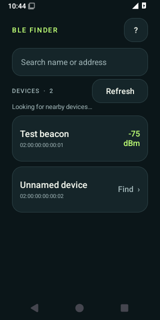
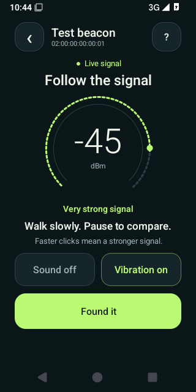

# BLE Finder

Find a misplaced Bluetooth LE device by following its signal, with Geiger-counter-style clicks that get faster as the signal gets stronger.

Originally built to find a lost Amazfit watch whose vibration was too quiet to hear. It worked, so it became a general-purpose device finder.

**[Download the Android APK](https://github.com/AbdullahAhmed/ble-finder/releases/latest/download/ble-finder.apk)** · [APK in this repository](downloads/ble-finder.apk) · [Releases](https://github.com/AbdullahAhmed/ble-finder/releases)

<p>
  
  
</p>

Compact-layout screenshots from the Android emulator, using simulated devices and signal readings.

## How to use it

1. Install the APK on a phone running **Android 6.0 or later** with Bluetooth LE.
2. Open BLE Finder and allow Nearby Devices and precise Location when requested. If Bluetooth is off, accept the Android prompt to turn it on; scanning resumes automatically. If you decline, tap the status message or Refresh to retry. Keep Location enabled.
3. Pick your device from the list. Search by name or Bluetooth address if there are many devices nearby. Your most recent device stays available for next time.
4. Walk slowly, holding the phone the same way. Pause a few seconds in each spot and follow the faster clicks and stronger signal.
5. Tap **Found it** to stop. The phone’s volume buttons adjust the click volume.

If Android asks, allow your browser or file manager to install this downloaded app. No account, subscription, Zepp login, or device authentication key is needed.

## A simple interface

- Searchable device picker with live signal readings and stable rows that don’t jump around while you tap.
- Large signal dial, warmer/colder trend, and a small 30-second signal history on larger displays with standard text size.
- Independent phone sound and vibration controls.
- Stale readings stop the clicks and clear the live meter after three seconds.
- Screen stays awake while the app is visible. Bluetooth work and sound stop when you leave the app.

The device picker scans for up to one minute per refresh. An active search pauses after 20 minutes and can be resumed.

## What it can find

BLE Finder reads Bluetooth Low Energy advertisements. For connectable devices it also tries a read-only GATT connection and measures connected-link RSSI. That second method can work for a device that is connected to its usual companion app and is no longer advertising. Failed connections fall back to listening for broadcasts.

This can help locate compatible watches, fitness bands, sensors, beacons, and other BLE devices. It does **not** mean every Bluetooth product is supported. A device must be powered on and either advertise BLE or accept a BLE connection. Classic-only headphones, sleeping devices, devices inside charging cases, and accessories using changing private addresses may not be locatable. This app does not use Apple Find My or Google's crowdsourced finding network.

Unnamed devices are shown with their address; Bluetooth does not always supply a friendly name. Paired BLE-capable devices and devices with an existing GATT connection may also appear, even when they have no recent broadcast reading.

## Reading the signal

**Less negative is stronger:** `−50 dBm` is stronger than `−80 dBm`. Watch the trend as you move, rather than trying to turn a reading into metres. Transmit power, walls, furniture, your body, and phone orientation all affect signal strength. “Getting warmer” describes an improving radio signal, not a measured direction or guaranteed distance.

The app uses a three-reading median and exponential smoothing to reduce jitter. Switching between broadcast and connected readings resets smoothing so the two sources are not mixed.

## Compatibility and permissions

Minimum: Android 6.0 / API 23, Bluetooth LE hardware. One universal APK works on ARM and x86 phones; there are no native libraries. The app handles pre-Android-8 vibration and scan APIs, Android 12+ Bluetooth permissions, and modern display insets. Automated emulator checks cover Android 6, 8, and 15; emulator checks validate UI and API compatibility, not a physical Bluetooth radio. See the Actions tab for current results.

- **Nearby Devices** (Android 12+): scan and read the Bluetooth connection's signal.
- **Precise Location**: Android's BLE scan permission requirements and beacon visibility. The app intentionally does not declare `neverForLocation`, which can filter out some beacons. No GPS position is requested or stored.
- **Vibration**: optional pulses on your phone, classified as accessibility guidance so they are independent of keyboard/touch haptics. Android's applicable vibration settings still apply.

Everything runs locally. There is **no Internet permission**, analytics, cloud service, or location history. Only the last selected device and sound/vibration preferences are saved. The app does not pair or unpair devices, issue proprietary commands, change firmware, or make the selected accessory vibrate.

Android's permission behavior is documented in [Bluetooth permissions](https://developer.android.com/develop/connectivity/bluetooth/bt-permissions); scanning behavior is described in [Find BLE devices](https://developer.android.com/develop/connectivity/bluetooth/ble/find-ble-devices).

## Build

Native Java and Android Views, with no third-party runtime dependencies. Requires JDK 17 and Android SDK 35; Gradle 8.10.2 is included through the wrapper.

```sh
./gradlew testDebugUnitTest lintDebug assembleDebug
```

On Windows use `gradlew.bat`, or `./build.ps1`. Set `ANDROID_HOME` to your SDK directory (or `sdk.dir` in your local, untracked `local.properties`). Open this directory in Android Studio if preferred.

Install a development build:

```sh
adb install -r app/build/outputs/apk/debug/app-debug.apk
```

The repository's downloadable APK is a non-debuggable release build, signed with the maintainer's existing local development certificate so it updates the original personal app in place. The key is not in Git. Locally built or CI-built APKs use that machine's development certificate and may require uninstalling an existing differently signed build. CI APKs are test artifacts, not official updates.

Run the UI smoke test on an emulator:

```sh
./gradlew assembleDebug assembleDebugAndroidTest
bash scripts/emulator-smoke.sh
```

## License

[MIT](LICENSE). Built by Abdullah Ahmed with Codex.
